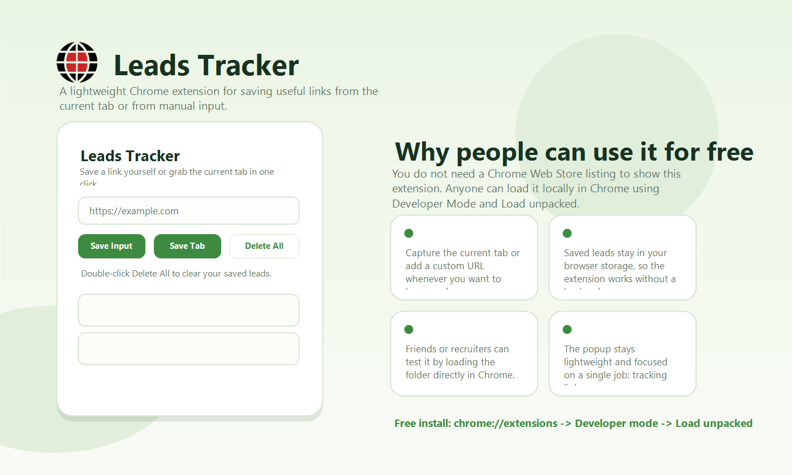
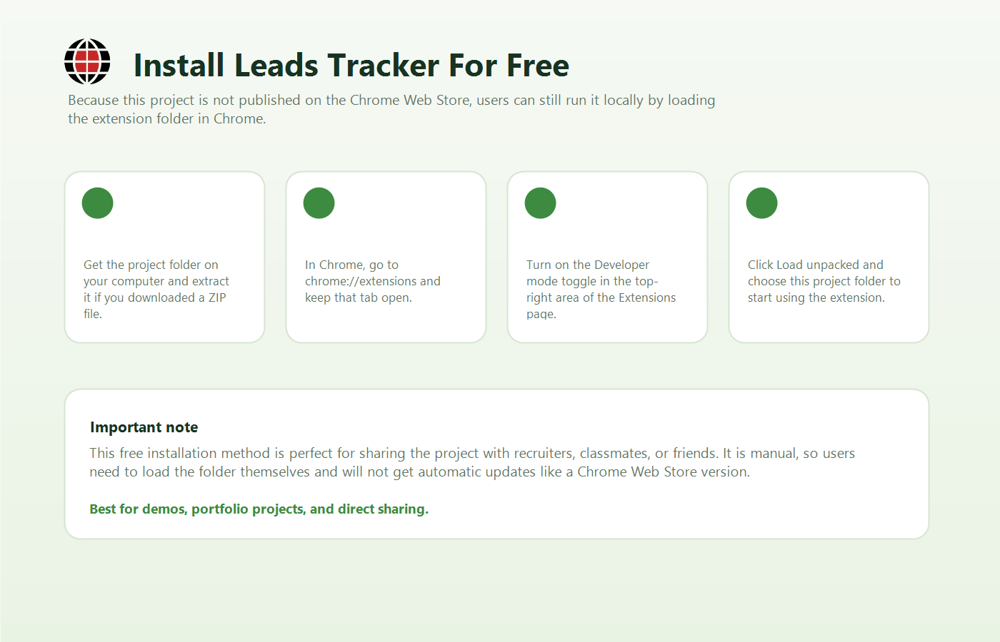

# Leads Tracker

Leads Tracker is a lightweight Chrome extension that helps users save useful links directly from the browser. You can store the current tab with one click or add a custom link manually, then open your saved leads later from a clean popup interface.

## Why This Project Is Useful

This extension is helpful for anyone who wants a simple way to collect and revisit important links while browsing. It is especially useful for students, job seekers, researchers, and anyone who regularly saves references from different websites.

Because this project is not published on the Chrome Web Store, it can still be used for free by loading it manually in Chrome through `Developer mode`.

## Features

- Save the current browser tab instantly
- Add custom links manually
- Store leads in local browser storage
- Open saved links directly from the popup
- Clear saved leads when needed
- Lightweight and easy to use

## Install In Chrome For Free

Anyone can use this extension locally in Chrome without paying for a Chrome Web Store listing.

1. Download this project as a ZIP file or clone the repository
2. Extract the folder if you downloaded the ZIP
3. Open Chrome and go to `chrome://extensions`
4. Turn on `Developer mode`
5. Click `Load unpacked`
6. Select this project folder
7. Open the extension from the Chrome toolbar and start saving links

## How To Use

1. Type a link into the input box and click `Save Input`
2. Or open any webpage and click `Save Tab`
3. Your saved links will appear in the popup
4. Click any saved link to open it in a new tab
5. Double-click `Delete All` to clear saved leads

## Built With

- HTML
- CSS
- JavaScript
- Chrome Extension Manifest V3

## Important Note

This project is best shared as a portfolio project, demo project, or GitHub repository. Since it is not published on the Chrome Web Store, users need to install it manually using the `Load unpacked` option in Chrome.
